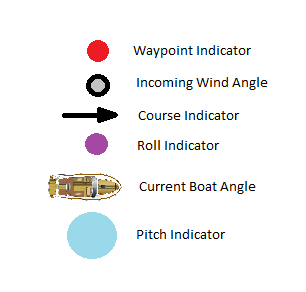

# Dalhousie Microtransat Autonomous SailBoat Team (DalMAST)
We are a team of Dalhousie students designing and building a sustainable, autonomous sailboat that will sail itself from Nova Scotia to Ireland as part of international competition. Aside from our project, we try to promote the Ocean Engineering and Technology Industry by hosting events and competitions for students.

From 2015 to the fall of 2018, the sailboat team was managed by Dalhousie faculty, including the previous Dean of Engineering, Dr. Leon. The most recent iteration of the vessel, the Sea Leon, was launched in the summer of 2018, with great success. It travelled for more than 3700km over 76 days before it ceased to transmit its location. In 2018, the responsibilities of the sailboat were transferred over to Dalhousie engineering students.

### Websites: 
Our website: [dalmast.squarespace.com](https://dalmast.squarespace.com), The competition: [microtransat.org](https://www.microtransat.org/)

### Current Software Team
As of Feb 2022:

Ethan Johnston - Team Lead  
Yiming Zhang - Team Member  
Ope Adelasoye - Team Member  
Grant Sutherland - Team Member  
Mathew Cockburn - Actually on electrical team but really likes to code so we are borrowing them.

### Credits

Alex Whidden - Conversion to FreeRTOS - REPORT  
Blake Meech  - REPORT  
Anthony Chalmers  
Serge Toutsenko  
Julia Sarty  
Thomas Gwynne-Timothy  - REPORT  
Jean Francois Bousquet  

Let Ethan know if there is anyone else.

## Technical Details and Background

Wiring, devices, mechanical background

## Using a RTOS (FreeRTOS)

How this works and how to add tasks and how the kernal works.

## Uploading Code

1.
2.
3.

## Uploading Waypoints:

Creating KML waypoints file from Google Earth:
1. 
2.
3.

Uploading to EEPROM using Processing KML Uploader script
1.
2.
3.

## Function Map Diagram

## Navigation

## Radio Message Decoding Table

## Using Test Functions

## GUI setup instructions 
In order to run the GUI that communicates with the radio module, **Processing** must be downloaded,
which you can do [here.](https://processing.org/download/)

After installing, import the G4P library under Sketch > Import Library > Add Library > G4P

To run, open the file of type Proccessing Source Code

## Useful Links and Resources

[OLD Sailboat Overview](Sailboat_Docs/presentation/sailboat_overview.pptx)  
[Thomas Report (Good for Radio Codes)](Sailboat_Docs/report/master.pdf)  
[dalmast.squarespace.com](https://dalmast.squarespace.com)  
